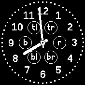
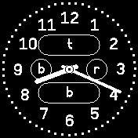
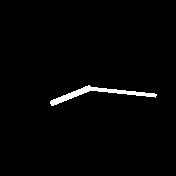
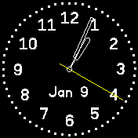

# banglejs-2-simple-clockwork #

implements a simple clockwork for analog clocks on a Bangle.js 2

This module implements a simple "clockwork" for analog clocks based on the [Analog Clock Construction Kit](https://github.com/rozek/banglejs-2-analog-clock-construction-kit).

## Usage ##

Within a clock implementation, the module may be used as follows:

```
let Clockwork = require(https://raw.githubusercontent.com/rozek/banglejs-2-simple-clockwork/main/Clockwork.js);
Clockwork.windUp({
  size:      <opt. clock size calculator>,
  background:<opt. clock background>,
  face:      <opt. clock face>,
  hands:     <opt. clock hands>,
  complications:{ <opt. set of complications and where to place them> }
}, { <opt. settings> }});
```

The `complications` setting is an object with the following fields (all of them are optional):

* `tl` - top left corner
* `t` - top edge
* `tr` - top right corner
* `l` - left edge
* `r` - right edge
* `bl` - bottom left corner
* `b` - bottom edge
* `br` - bottom right corner

Just assign a complication to any of these keys in order to place it at the position that key stands for. Complications assigned to `tl`, `tr`, `l`, `r`, `bl` or `br` will be allocated a small region only, while complications assigned to `t` or `b` may become a bit larger. However, complications in field `t` will prevent complications in fields `tl` and `tr` from being shown. Similarly, if a complication is assigned to field `b`, fields `bl` and `br` will be ignored.

The following two screenshots illustrate, how the mentioned keys correlate with size and position of a complication:

<table>
 <tr valign="top">
   <td align="center"><br>small complications only</td>
   <td align="center"><br>small and large complications</td>
 </tr>
</table>

The actually available space for any complication depends on the actual radius of the clock (which itself depends on the clock size calculator used and the visible widgets) and is passed to its drawing function as a value for parameter `Radius`.

## Examples ##

A minimal example for an analog clock using this clockwork looks as follows:

```
let Clockwork = require('https://raw.githubusercontent.com/rozek/banglejs-2-simple-clockwork/main/Clockwork.js');
Clockwork.windUp();
```

and produces the following clock:



A more typical example looks like:

```
let Clockwork = require('https://raw.githubusercontent.com/rozek/banglejs-2-simple-clockwork/main/Clockwork.js');

Clockwork.windUp({
  size:      null,
  background:null,
  face:      require('https://raw.githubusercontent.com/rozek/banglejs-2-twelve-fold-face/main/ClockFace.js'),
  hands:     require('https://raw.githubusercontent.com/rozek/banglejs-2-hollow-clock-hands/main/ClockHands.js'),
  complications:{
    b:require('https://raw.githubusercontent.com/rozek/banglejs-2-date-complication/main/Complication.js')
  }
},{ withDots:true, Seconds:'#FFFF00' });
```

and produces



## License ##

[MIT License](LICENSE.md)
